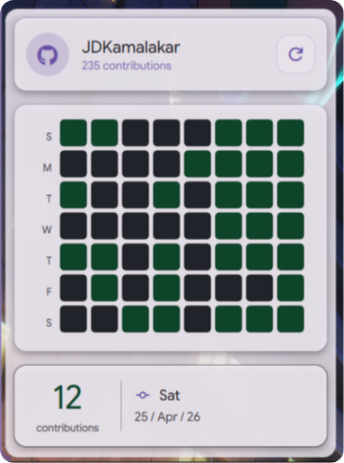
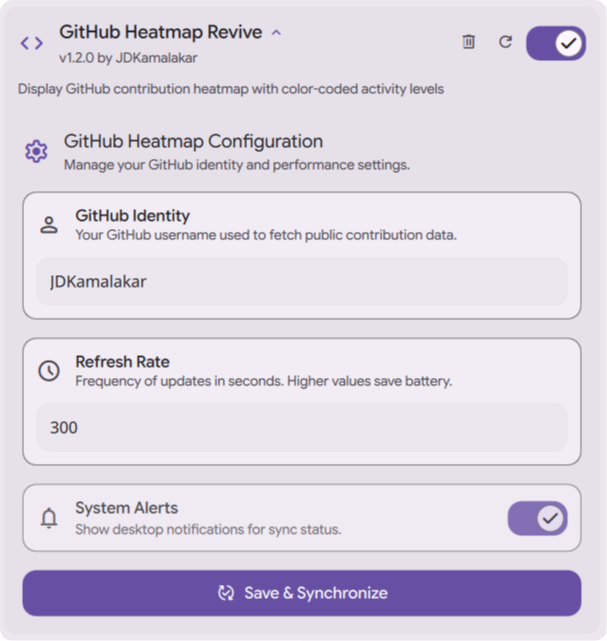

# [DMS-GitHub_HeatMap](#)

### Visual Contribution Tracker
Integrated GitHub contribution heatmap for Dank Material Shell – monitor your coding streaks with style. (Revived)

## Download

*Requires Dank Material Shell (DMS) 1.0 or higher.*

## Features

* **Real-time Sync**: Automatically fetches your latest GitHub contributions.
* **8-Week History**: Detailed calendar grid showing your activity over the last two months.
* **Interactive Tooltips**: Hover over any day to see the exact date and contribution count.
* **Material Aesthetics**: Premium animations, glassmorphism effects, and smooth transitions.
* **Bar Pill Integration**: Quick-glance 7-day activity directly in your Dank Bar.
* **Deep Settings**: Customize refresh intervals and account details.

## Interface

  

## Configuration

  

## Contributing

Pull requests are welcome. For major changes, please open an issue first to discuss what you would like to change.

Before reporting a new issue, take a look at the [FAQ](https://github.com/JDKamalakar/DMS-GitHub_HeatMap/wiki), the [changelog](https://github.com/JDKamalakar/DMS-GitHub_HeatMap/releases) and the already opened [issues](https://github.com/JDKamalakar/DMS-GitHub_HeatMap/issues).

### Credits

Built with ❤️ for the [Dank Material Shell](https://github.com/DankMaterialShell) community.

### Disclaimer

This application is an independent utility for Dank Material Shell.

### 📜 License

Part of DankMaterialShell. Check the main repository for license information.

